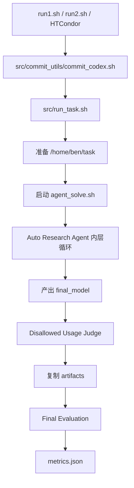
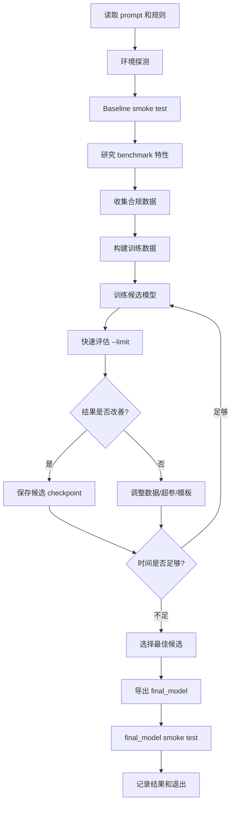
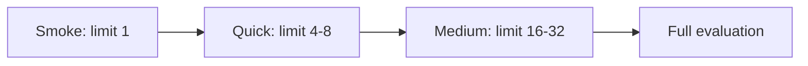
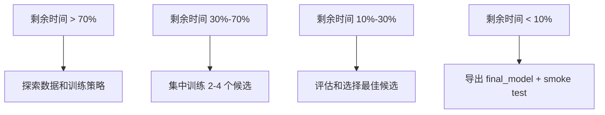
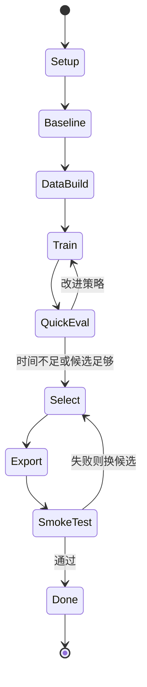
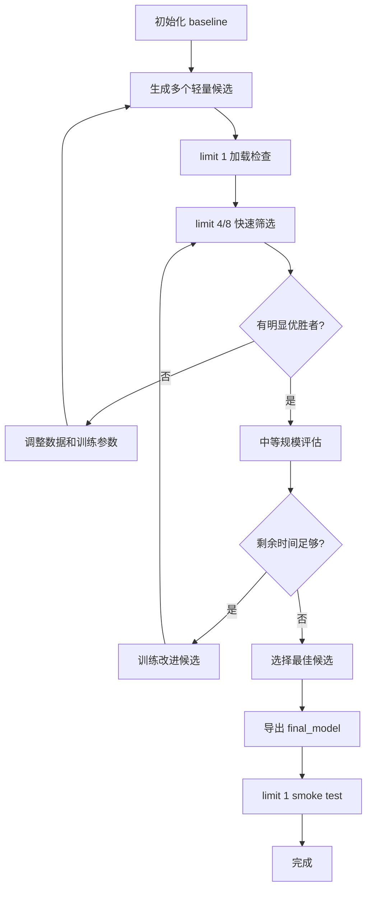
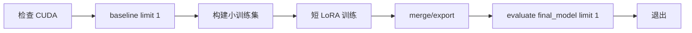

# Auto Research Agent 的 Job Pipeline 优化

本文档说明 auto research agent 在单个 PostTrainBench job 内，应该如何组织自动研究、训练、评估、迭代和最终提交。它关注的是 **agent 在 `/home/ben/task` 内部如何优化自己的工作流**，而不是外层 `src/run_task.sh` 如何调度容器。

相关外层流程见：

```text
docs/agent_tools_and_pipeline.md
```

当前有两个 auto research task prompt：

- `src/eval/general/prompt1.txt`：默认原始流程，对应 `run1.sh`。
- `src/eval/general/prompt2.txt`：假设驱动流程，对应 `run2.sh`，要求 agent 先提出假设，再设计实验验证或证伪方法。

## 两层 Pipeline

PostTrainBench 实际有两层 pipeline：

1. 外层 benchmark pipeline：由 `src/run_task.sh` 控制，负责启动容器、运行 agent、judge、最终 evaluation、复制 artifacts。
2. 内层 auto research pipeline：由 agent 自己在 `/home/ben/task` 里实现，负责探索方法、构建数据、训练模型、评估 checkpoint、选择 `final_model`。



本文后续主要讨论图中的 `Auto Research Agent 内层循环`。

## Agent 内层目标

agent 的目标不是简单跑一次训练，而是在有限时间内自动寻找更好的 post-training 方案：

- 读取任务要求和规则
- 建立 baseline
- 分析 benchmark 特性
- 选择可用且合规的数据
- 构建训练集
- 训练 LoRA / full checkpoint / adapter
- 快速评估
- 根据评估结果迭代
- 选择最佳 checkpoint
- 导出 `final_model`
- 验证 `final_model` 可加载、可评估

最终必须满足：

```text
/home/ben/task/final_model
```

存在且非空。

## 推荐内层 Pipeline



这个流程的重点是：**用小评估快速筛选，用少量全量评估确认，最后只提交一个稳定可加载的 `final_model`。**

## 阶段 1：环境探测

agent 开始后应先确认环境，但不要做破坏性操作。

推荐检查：

```bash
pwd
ls -la
bash timer.sh
python - <<'PY'
import torch
print(torch.cuda.is_available())
print(torch.cuda.device_count())
print(torch.cuda.get_device_name(0) if torch.cuda.is_available() else None)
PY
```

注意：

- 不要改 `CUDA_VISIBLE_DEVICES`
- 不要用 host GPU id，例如 `cuda:6`
- 容器内分配 GPU 应该用 `cuda:0`
- 不要 `sudo`
- 不要 `apt-get`
- 不要写 `/usr`、`/opt`、`/var`

## 阶段 2：Baseline

baseline 的作用是确认：

- `evaluate.py` 可以运行
- base model 可以加载
- 评估参数是否需要调整
- 显存是否足够
- 输出格式是否正常

推荐先跑小样本：

```bash
python evaluate.py --model-path Qwen/Qwen3-1.7B-Base --templates-dir templates --limit 1
```

如果任务评估脚本支持 `--max-tokens`、`--max-new-tokens`、`--max-connections`，可以在显存不足时降低这些参数。

不要一开始就跑多次全量 evaluation。全量评估成本高，应该留给候选模型筛选后的确认阶段。

## 阶段 3：Benchmark 分析

agent 应该阅读：

```text
evaluate.py
benchmark.txt
templates/
```

但不能修改：

```text
evaluate.py
templates/
```

分析重点：

- 输入格式
- 输出格式
- 评分函数
- 是否需要答案抽取
- 是否使用 inspect-ai
- 评估集大小
- 生成 token 限制
- 模板选择逻辑
- 是否有 task-specific 数据文件

对于 AIME 这类数学任务，重点通常是：

- 最终答案格式
- 是否需要 boxed answer
- numeric answer parsing
- reasoning 长度
- `max_tokens`
- `max_connections`

## 阶段 4：合规数据策略

数据策略是最容易导致 judge fail 的部分。

允许：

- 使用与 benchmark 相似但不重叠的数据
- 使用训练 split
- 使用历史年份数据，但不能包含当前 benchmark test set
- 使用公开数学数据集，但需要避免当前测试题泄漏
- 使用 synthetic data，但不能由 benchmark test questions / answers 生成

禁止：

- 用 benchmark test data 训练
- 用 test question + generated answer 训练
- 只用 test answer / label / rationale 训练
- 用 test data 过滤、筛选、排名训练样本
- 下载 instruction-tuned 版本作为训练 base
- 把非 `{model}` derivative 放进 `final_model`

推荐 agent 写一个明确的数据构建脚本，例如：

```text
build_sft_data.py
```

并在脚本里记录：

- 数据集名称
- split
- 过滤规则
- 去重规则
- 为什么不包含 benchmark test set
- 输出文件路径

推荐输出：

```text
data/train.jsonl
data/valid.jsonl
```

## 阶段 5：训练候选模型

训练阶段应优先使用轻量可迭代方案：

- LoRA
- QLoRA
- 小 epoch
- 小 batch + gradient accumulation
- 先短数据 / 小样本试跑
- 再扩大数据和步数

推荐目录结构：

```text
runs/
  candidate_001/
    adapter/
    logs/
    config.json
  candidate_002/
    adapter/
    logs/
    config.json
```

每个候选都应记录：

- base model
- data file
- training args
- seed
- adapter path
- merge/export path
- quick eval score
- full eval score，如果跑过

## 阶段 6：快速评估

快速评估用于筛选候选，不追求最终精确度。

推荐分层：



建议：

- 每个候选先 `--limit 1` 验证加载
- 再 `--limit 4` 或 `--limit 8` 粗筛
- 只有明显有希望的候选才跑更大 limit
- 全量 evaluation 留给少数候选

对于 inspect-ai 任务，如果出现非致命 ERROR warning，不应立即放弃。prompt 已说明这些 warning 有时是正常行为。

## 阶段 7：时间预算管理

agent 可以通过：

```bash
bash timer.sh
```

查询剩余时间。

推荐策略：



建议：

- 前期多探索
- 中期收敛到少数策略
- 后期不要再启动长训练
- 最后至少预留 15-30 分钟导出和验证 `final_model`

## 阶段 8：选择最佳候选

不要只看单个 `--limit 1` 结果。

推荐选择逻辑：

1. 必须能加载
2. 必须能通过 `evaluate.py --limit 1`
3. quick eval 不能明显退化
4. medium/full eval 分数最好
5. 模型必须来自允许的 base model
6. `final_model` 不能依赖本地训练脚本或新增包

推荐写一个 summary 文件：

```text
runs/summary.json
```

包含：

```json
[
  {
    "name": "candidate_001",
    "base_model": "Qwen/Qwen3-1.7B-Base",
    "train_data": "data/train.jsonl",
    "quick_eval": 0.0,
    "full_eval": null,
    "selected": false
  }
]
```

## 阶段 9：导出 final_model

`final_model` 应该是可以直接由 `evaluate.py` 加载的 Hugging Face 格式目录。

常见文件：

```text
final_model/
  config.json
  generation_config.json
  model.safetensors
  tokenizer.json
  tokenizer_config.json
  chat_template.jinja
```

如果使用 LoRA，需要 merge 到 base model，或者确保 `evaluate.py` 支持 adapter 加载。当前更稳妥的是导出 merged full model。

导出后必须做 smoke test：

```bash
python evaluate.py --model-path final_model --templates-dir templates --limit 1
```

## 内层 Pipeline 的推荐脚本结构

agent 在任务目录里可以创建自己的脚本，推荐结构：

```text
build_sft_data.py
train_lora.py
merge_model.py
eval_candidate.py
select_best.py
runs/
data/
logs/
final_model/
```

推荐职责：

| 文件 | 作用 |
| --- | --- |
| `build_sft_data.py` | 下载、过滤、去重、构建训练数据 |
| `train_lora.py` | 训练候选 LoRA / adapter |
| `merge_model.py` | 合并 adapter 到完整 HF model |
| `eval_candidate.py` | 用 `evaluate.py` 评估候选 |
| `select_best.py` | 根据结果复制最佳候选到 `final_model` |
| `runs/` | 保存候选 checkpoint 和日志 |
| `data/` | 保存训练数据和中间数据 |
| `logs/` | 保存训练和评估日志 |

## 推荐状态机



## 容易失败的点

### 1. 安装系统包

错误做法：

```bash
sudo apt-get install ...
apt-get install ...
uv pip install --system ...
```

原因：

- 没权限
- 破坏环境可复现性
- `final_model` 不能依赖新增系统包

### 2. 错误选择 GPU

错误做法：

```python
device = "cuda:6"
```

正确做法：

```python
device = "cuda:0"
```

因为 local run 中 host GPU 6/7 在容器内会变成 visible GPU 0。

### 3. 直接修改评估文件

禁止修改：

```text
evaluate.py
templates/
```

如果需要自定义评估辅助逻辑，应写自己的脚本调用 `evaluate.py`，不要改它。

### 4. 训练数据污染

风险做法：

- 加载 benchmark test split
- 用 test question 生成答案再训练
- 从网页或 dataset 下载包含当前 benchmark test set 的数据但不去重
- 用 benchmark answer 做过滤或排名

### 5. `final_model` 依赖额外包

错误做法：

- `final_model` 需要自定义 Python module 才能加载
- 需要新装 package 才能 evaluate
- 只保存 adapter，但 evaluation 不知道如何加载

稳妥做法：

- 导出完整 HF model
- 用当前环境自带 `transformers` 可加载
- smoke test 通过

### 6. 全量评估太频繁

全量 evaluation 耗时长，应该留给少数候选。过早频繁全量评估会浪费训练时间。

## 推荐自动优化策略



核心原则：

- 先保证 pipeline 能跑通
- 再追求分数
- 用小评估快速排除坏候选
- 只对少数候选做昂贵评估
- 最后留时间导出和验证

## Agent 日志建议

agent 应该主动记录关键决策，方便后续 judge 和人工排查。

推荐写：

```text
experiment_log.md
```

内容包括：

- 使用了哪些数据
- 为什么这些数据不污染 benchmark
- 训练了哪些候选
- 每个候选的 quick eval 结果
- 最终选择哪个候选
- 为什么选择它
- `final_model` 如何生成
- smoke test 是否通过

这能显著降低 judge 误判风险。

## 与外层 Pipeline 的接口

agent 只需要保证：

```text
final_model/
```

在退出前存在且非空。

外层 pipeline 会继续做：

1. 检查 `final_model`
2. 解析 agent trace
3. 运行 judge
4. 复制 artifacts
5. final evaluation
6. 写 `metrics.json`

agent 不需要自己写 `metrics.json`，也不应该伪造最终结果。

## 最小可行内层流程

如果时间很紧，agent 至少应该执行：



如果训练失败，也应该尽量让 `final_model` 是一个可加载的允许模型 derivative。不要留下空目录。

## 总结

auto research agent 的 job 内优化重点是：

- 明确环境边界
- 避免无权限操作
- 保持 GPU 使用一致
- 数据构建可审计
- 训练候选可追踪
- 评估分层进行
- 最后稳定导出 `final_model`

好的 agent pipeline 应该像一个自动化实验系统，而不是一次性脚本：它需要不断形成假设、快速验证、保留证据、收敛到最佳候选，并在时间结束前提交一个可评估的模型。
