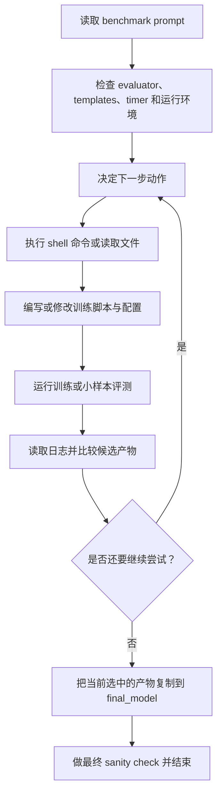
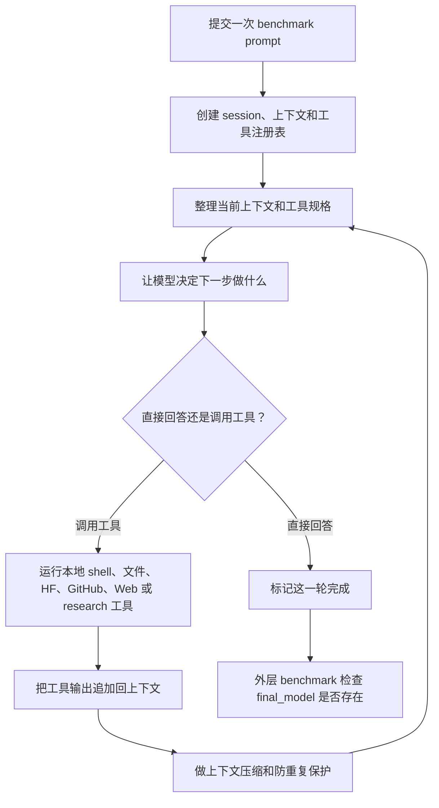
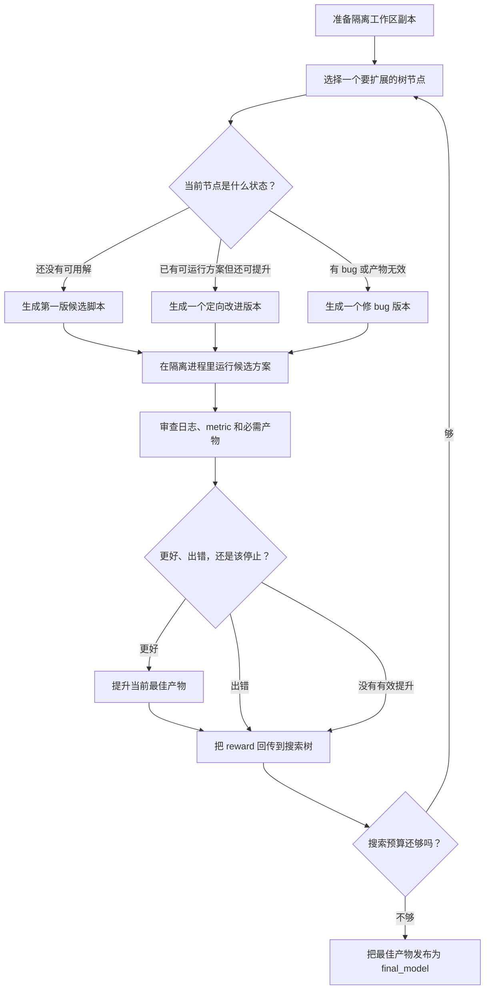
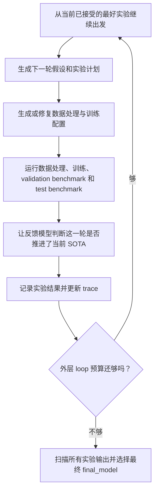
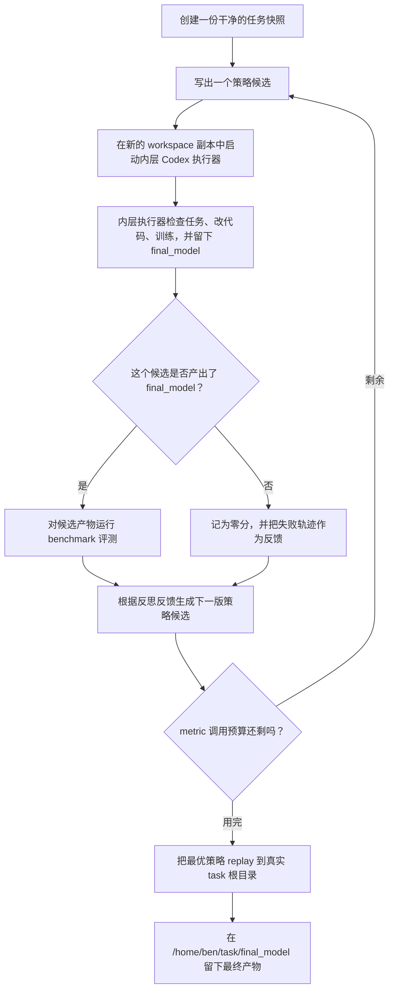

# Baseline Agent Loop 说明

本文档总结当前 `results/` 下正在跑的 baseline family 的 loop 结构。
重点不是“谁启动了进程”，而是“真正驱动实验迭代的是哪一层 loop、每一步在做什么、什么时候停、PostTrainBench 额外改了什么控制流、当前实现有哪些问题”。

范围说明：
- 分析单位是 baseline family，不是每个单独 run 文件夹。
- 当前只覆盖 `results/` 里活跃的 5 个 family：`codex_non_api_high`、`ml_intern`、`ml_master`、`rdagent`、`gepa`。
- 类似 `rdagent_gpt-5.5_10h`、`gepa_gpt-5.5_10h` 这种重复或空目录不单独展开。
- 对闭源执行器，如 Codex CLI，本文件只能结合 wrapper 代码和 `solve_raw.txt` trace 反推 loop。

## 总览

| Baseline | Wrapper 入口 | 上游入口 | Loop 类型 |
| --- | --- | --- | --- |
| `codex_non_api_high` | `agents/codex_non_api_high/solve.sh` | 闭源 Codex CLI | 单次 agent 工具循环 |
| `ml_intern` | `agents/ml_intern/solve.sh` | `third_party/ml-intern/agent/main.py` | upstream headless 工具循环 |
| `ml_master` | `agents/ml_master/solve.sh` | `third_party/ML-Master/main_mcts.py` | MCTS 树搜索 |
| `rdagent` | `agents/rdagent/solve.sh` | `third_party/rd-agent/rdagent/app/finetune/llm/loop.py` | 显式多轮 experiment loop |
| `gepa` | `agents/gepa/solve.sh` | `agents/gepa/gepa_driver.py` + `third_party/gepa/src/gepa/optimize_anything.py` | 外层策略优化 + 内层 Codex 执行双层 loop |

## 1. Codex Non-API High

`codex_non_api_high` 是最轻的一种集成方式。PostTrainBench 只负责启动一次 Codex CLI solve 进程，让它在 benchmark task 目录里自主操作。benchmark 本身没有再包一层显式搜索 loop，因此这里能观察到的 loop 基本就是 Codex CLI 自己的“看环境、做动作、看结果、再做动作”循环。

- `停止条件：` 内层 Codex 进程自己判断任务完成，或者被外层 benchmark 超时杀掉。
- `工具：` 本地 shell、文件读写编辑，以及 Codex CLI 自带的内部工具能力；benchmark 没有额外提供搜索器。
- `PTB 适配：` wrapper 只负责强制走 ChatGPT 登录态、清空 API key、设置高推理 effort，并把 benchmark prompt 原样转发进去。
- `可观测性：` 内层闭源，因此这一节以 trace 为主，不是源码级完整可证。

`Evidence:` `agents/codex_non_api_high/solve.sh`, `results/codex_non_api_high_gpt-5.5_10h_prompt1_gpu2_htcondor/gsm8k_Qwen_Qwen3-1.7B-Base_38/solve_raw.txt`, `src/run_task.sh`.

## 2. ML-Intern

`ml_intern` 基本保留了 upstream 原生 loop。PostTrainBench 主要做的是改配置、改 prompt、改启动方式，然后把控制权交给 upstream headless runner。真正的主循环仍然是标准的 `LLM -> tool calls -> tool results -> 下一轮 LLM`。

- `停止条件：` 模型不再产生 tool call、达到 `max_iterations`、session 失败、或者外层超时。当前 wrapper 默认把 `max_iterations` 设为 300。
- `工具：` benchmark 强制 `tool_runtime=local`，因此主工具是本地 `bash/read/write/edit`，外加 upstream 自带的 research、HF、GitHub 和 Web 工具。
- `PTB 适配：` wrapper 会重写 `cli_agent_config.json`、开启 `yolo_mode`、清空 `mcpServers`、在 prompt 前加 benchmark 约束，并用 headless 模式启动 upstream agent。
- `子循环：` approval handling 自己是一层子循环；`research` 工具内部也还有一个独立的小循环。

`Evidence:` `agents/ml_intern/solve.sh`, `third_party/ml-intern/agent/main.py`, `third_party/ml-intern/agent/core/agent_loop.py`, `results/ml_intern_gpt-5.5_10h_prompt1_gpu3_ml_intern_htcondor/gsm8k_Qwen_Qwen3-1.7B-Base_33/solve_raw.txt`, `docs/ml_intern_agent.md`.

## 3. ML-Master

`ml_master` 不是普通的 tool loop，而是一个真正的搜索控制器。外层 loop 维护一棵候选实现树：每个节点存一份候选代码及其执行结果。控制器会扩 draft 节点、改进好节点、修复坏节点，并把 reward 沿树向上回传。

- `停止条件：` 当前 run 的主硬停止是 `ML_MASTER_STEPS=24`；每个候选执行还有单独 timeout。草稿、改进、debug 分支各自也有本地预算。
- `工具：` 代码模型负责生成候选，反馈模型负责阅读执行输出并判定结果，本地解释器负责在隔离 workspace 中执行候选代码。
- `PTB 适配：` PostTrainBench 把产物契约从 `submission.csv` 改成 `submission/final_model`，注入 `datasets` / `Trainer` shim，强制 `num_workers=0` 等 worker-safe 配置，最后再把最佳提交实体化到 `/home/ben/task/final_model`。
- `搜索形态：` 这是有 `visits / reward / backpropagation` 的有界 UCT 风格树搜索，不是单链 improve，也不是 beam search。

`Evidence:` `agents/ml_master/solve.sh`, `third_party/ML-Master/main_mcts.py`, `third_party/ML-Master/agent/mcts_agent.py`, `results/ml_master_gpt-5.5_10h_prompt1_gpu4_ml_master_htcondor/gsm8k_Qwen_Qwen3-1.7B-Base_82/solve_raw.txt`.

## 4. RD-Agent

`rdagent` 是当前这批 baseline 里外层结构最显式的一种。默认 `sft` 路径下，每一轮外层 loop 都会生成一个新的 fine-tuning experiment，写数据处理和训练配置，跑训练与 benchmark 评测，再让 LLM 给 feedback，并把结果写回 trace 供下一轮继续用。benchmark wrapper 最后再扫所有 workspace，挑一个最好的 `output` 目录作为 `final_model`。

- `停止条件：` 当前 wrapper 使用 `RD_AGENT_MODE=sft`，默认 `RD_AGENT_LOOP_N=3`；此外全局 timeout 和 step budget 也会终止循环。
- `工具：` 外层 loop 源码可见，但 `coding` 和 `running` 阶段内部都还套着自己的代码修复子循环，前者更深，后者更浅。
- `PTB 适配：` PostTrainBench 把默认路径硬接成 benchmark-aware 的 SFT 流程，训练数据当前写死成 `deepscaler`，还会在正式搜索前先跑一遍 baseline benchmark，并在收尾阶段把最佳 workspace 产物复制到 `/home/ben/task/final_model`。
- `选择逻辑：` agent core 只是在 trace 里维护被接受的 experiment，真正的 final model 选择下沉到了 wrapper 层，靠 validation summary CSV 做筛选，必要时退化成按 `mtime` 选最新。

`Evidence:` `agents/rdagent/solve.sh`, `third_party/rd-agent/rdagent/app/finetune/llm/loop.py`, `third_party/rd-agent/rdagent/utils/workflow/loop.py`, `third_party/rd-agent/rdagent/components/workflow/rd_loop.py`, `results/rdagent_gpt-5.5_10h_prompt1_gpu6_rdagent_htcondor/gsm8k_Qwen_Qwen3-1.7B-Base_81/solve_raw.txt`.

## 5. GEPA

`gepa` 是一个双层 loop 系统。外层 loop 不是直接训练模型，而是优化一段“策略 prompt”；内层 loop 才是拿着这段策略 prompt 去驱动一次 Codex 执行器，在一个干净 task snapshot 里尝试完成 benchmark 任务。外层 evaluator 再给这次 candidate 打分、更新最优策略、继续下一轮。当前配置里，外层预算是 `GEPA_MAX_METRIC_CALLS=4`。

- `停止条件：` 外层 loop 主要受 metric-call budget 控制，不只是 benchmark 总时长。当前 run 设置了 `GEPA_MAX_METRIC_CALLS=4`、`GEPA_CANDIDATE_TIMEOUT_SECS=3600`、`GEPA_FINAL_TIMEOUT_SECS=7200`。
- `工具：` 外层 loop 源码可见、反思驱动；内层 loop 是 trace 可见的 Codex CLI 执行器，会在每个 task 副本里使用 shell、文件编辑、训练和评测命令。
- `PTB 适配：` driver 会快照 task root 和 Codex auth，为每个 candidate 生成单独 timeout 脚本，用 `evaluate.py` 给 candidate 打分，最后只把最优策略 replay 回真实 task root。
- `双重预算：` candidate scoring 用的是更小的 eval limit 和更短的内层预算，因此外层分数天然只是 final replay 的 proxy。

`Evidence:` `agents/gepa/solve.sh`, `agents/gepa/gepa_driver.py`, `third_party/gepa/src/gepa/optimize_anything.py`, `run_gpu7_gepa_htcondor.sh`, `results/gepa_gpt-5.5_10h_prompt1_gpu7_gepa_htcondor/gsm8k_Qwen_Qwen3-1.7B-Base_75/solve_raw.txt`.

## 当前 loop 实现的问题

### 共性问题

- 很多 baseline 并没有把 `final_model` 作为内部 loop 的硬完成条件。agent 内部可能已经“认为自己做完了”，但真正是否满足 benchmark 契约，要等外层 wrapper 收尾时才知道。
- 内部候选选择信号往往只是最终 benchmark 指标的 proxy。小 validation slice、局部 benchmark、或自定义内部 metric，都可能和最终 `evaluate.py` 结果发生漂移。
- 时间预算没有形成统一闭环。benchmark 总时长、每个 candidate 的时长、每个节点的执行时长、每层子循环的 retry 预算，往往由不同层各管各的。
- 多层嵌套 loop 会降低可观测性。外层搜索器和内层代码修复/训练循环叠在一起后，真正做错决策的地方不一定和最后报错的地方是同一层。

### 各 baseline 特有问题

- `codex_non_api_high`：没有显式 benchmark 级外层搜索控制器，实验质量完全依赖单次 Codex solve session；代表性 trace 里还能看到 copy `final_model` 与启动评测并发进行的竞态风险。
- `ml_intern`：`yolo_mode + local tools` 风险很高；research 子代理在 local runtime 下并不真正只读；并发工具执行也可能在共享目录上产生竞态。
- `ml_master`：reward 和 metric plumbing 容易退化，因为部分判断依赖 reviewer 从 stdout 弱提取结构化信息；`steps` 是硬停止而 `time_limit` 更像软提示；`final_model` 路径改写是字符串级别，不是语义级 hook。
- `rdagent`：最终 best model 选择下沉到 wrapper 而不是外层 loop 自己闭环；默认 benchmark 设置把训练数据路径写死；baseline benchmark 前置会先消耗一部分预算；`rl` 分支明显比 `sft` 分支更像占位实现。
- `gepa`：双层 loop 开销大；外层分数基于小预算 candidate-eval proxy，而不是 final replay 设定；整体效果很依赖内层 Codex 能否在很短 candidate budget 内自己组织出高质量训练 loop。

## 总结

这 5 个 baseline 大致分成三类：
- 纯 agent 工具循环：`codex_non_api_high`、`ml_intern`
- 显式搜索控制器：`ml_master`、`rdagent`
- 双层策略优化：`gepa`

当前最核心的问题不是“它们没有 loop”，而是很多 loop 用局部 proxy 在做决策，而真正的成功条件，也就是 `final_model` 是否符合 benchmark 契约以及最终 benchmark 分数，仍然是在 PostTrainBench 外层才被统一裁决。
