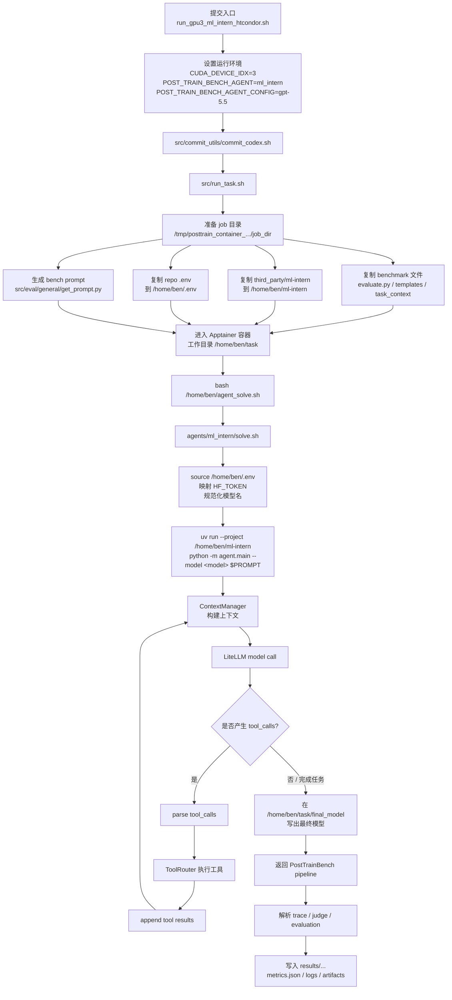
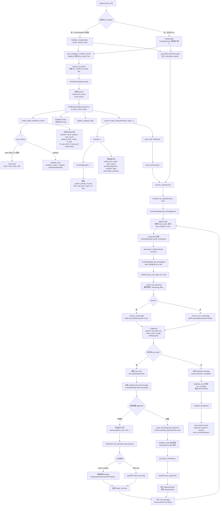

# `ml_intern` Agent 说明

`ml_intern` 使用干净的 upstream `huggingface/ml-intern`，不再使用 `ml_intern_codex` 或任何 Codex backend patch。

运行方式：

```text
src/run_task.sh
  -> copy third_party/ml-intern to /home/ben/ml-intern
  -> copy repo .env to /home/ben/.env
  -> bash /home/ben/agent_solve.sh
  -> agents/ml_intern/solve.sh
  -> source /home/ben/.env
  -> uv run --project /home/ben/ml-intern python -m agent.main --model <model> "$PROMPT"
```

也就是说，agent loop 是 upstream ml-intern 原生 loop：

```text
ContextManager -> LiteLLM model call -> parse tool_calls -> ToolRouter -> append tool results -> repeat
```

## PostTrainBench 接入流程图



## ml-intern 源码 Framework

下面这张图按 `third_party/ml-intern` 的源码结构整理：

- CLI / headless 入口：`agent/main.py`
- agent 主循环：`agent/core/agent_loop.py`
- session 状态：`agent/core/session.py`
- 上下文管理：`agent/context_manager/manager.py`
- 工具注册与路由：`agent/core/tools.py`
- 本地工具：`agent/tools/local_tools.py`

PostTrainBench 通过 `python -m agent.main --model <model> "$PROMPT"` 走的是 headless 路径，因此 `headless_main()` 会创建一次性 submission，等待 agent 完成后退出。



核心循环可以简化为：

```text
submission_queue
  -> process_submission
  -> Handlers.run_agent
  -> ContextManager.get_messages + ToolRouter.get_tool_specs_for_llm
  -> LiteLLM acompletion
  -> parse tool_calls
  -> ToolRouter.call_tool
  -> append tool result messages
  -> repeat until no tool_calls
```

PostTrainBench 的 bench prompt 仍然来自 `src/eval/general/get_prompt.py`，通过 `$PROMPT` 原样传给 ml-intern。agent 仍需在 `/home/ben/task/final_model` 产出最终模型。

## API Key

`solve.sh` 会读取：

```text
/home/ben/.env
```

该文件由 `src/run_task.sh` 从 repo 根目录的 `.env` 复制进 job home。脚本不会打印 `.env` 内容。

如果 `.env` 中没有 `HF_TOKEN`，但有下面任意变量，会自动映射为 `HF_TOKEN`：

```text
HUGGING_FACE_HUB_TOKEN
BEN_HF_TOKEN
HARDIK_HF_TOKEN
```

## 模型名

默认使用提交时的 `AGENT_CONFIG`。如果传入裸模型名，例如：

```text
gpt-5.5
```

会自动转成 upstream ml-intern README 中的格式：

```text
openai/gpt-5.5
```

也可以直接传：

```text
anthropic/claude-opus-4-7
openai/gpt-5.5
ollama/llama3.1:8b
vllm/meta-llama/Llama-3.1-8B-Instruct
```

## GPU3 提交

脚本：

```bash
bash run_gpu3_ml_intern_htcondor.sh
```

关键环境变量：

```text
CUDA_DEVICE_IDX=3
POST_TRAIN_BENCH_AGENT=ml_intern
POST_TRAIN_BENCH_AGENT_CONFIG=gpt-5.5
POST_TRAIN_BENCH_EXPERIMENT_NAME=_prompt1_gpu3_ml_intern_htcondor
```
